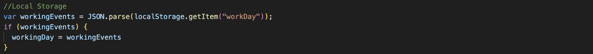

# Work Day Scheduler App

## Description

This is the week 7 project and the consists of creating a web app to help users to keep their daily activities organized.

I have learned how to use
- Dayjs to set the dates dynamically.
- forEach loop to iterate over each object in the array of objects.
- How to set the local storage.
- How to stringify a JSON file.

## Logic

- The Day.js library to get the current date and then formats it using the format method. The formatted date is then inserted into an HTML element with the ID "currentDay."
    
    
    
   
- The array called workingDay contains objects with properties time and event. This array represents the schedule for a working day, with default events set to an empty string.
    
    
    
 
- This section iterates over the workingDay array and dynamically creates HTML rows for each time block. It uses Bootstrap classes for styling. The rows are appended to an HTML element with the class "container."
  
    
    
- The function colorRow takes a time parameter and uses Day.js to compare it with the current time. Depending on whether the time is in the past, present, or future, a corresponding class name ("past," "present," or "future") is returned.
    
    
    
- This section retrieves data from local storage and parses it as JSON. If there are stored events, it updates the workingDay array with the stored events.
     
    
    
- I have added a click event listener to elements with the class "saveBtn." When a save button is clicked, it updates the corresponding event in the workingDay array and then stores the updated array in local storage as a JSON string.
     
    
    

## License

MIT License Copyright (c) 2024 Luis Marquez-Garrido

